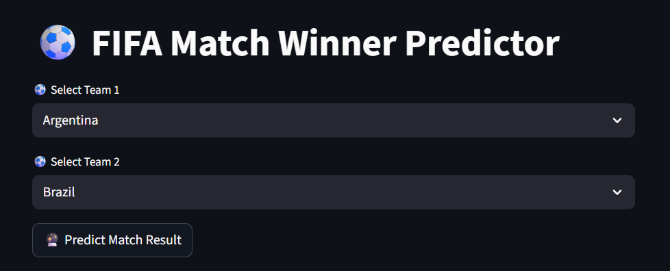
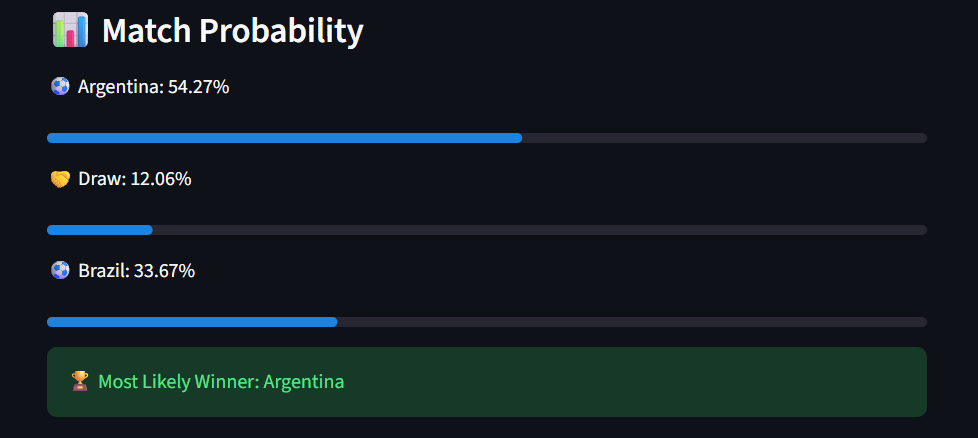

# ⚽ FIFA World Cup Match Winner Predictor

A Machine Learning powered web application that predicts the outcome of a football match between two qualified World Cup teams.

## 🚀 Project Overview

This project uses historical FIFA World Cup match data along with FIFA ranking data to predict:

- Team 1 Win Probability
- Draw Probability
- Team 2 Win Probability
- Most Likely Match Outcome

The application is built using:

- Python
- Scikit-learn (Random Forest)
- Streamlit
- Pandas
- Joblib

---

## 📊 Features

- Interactive team selection
- Probability-based prediction
- Colored progress bars
- Neutral team comparison (no home/away bias in UI)
- Clean and modern UI

---

## 🧠 Machine Learning Model

Model: RandomForestClassifier  
Features Used:
- Team Encoding
- Ranking Difference
- Points Difference

Training Data:
- FIFA World Cup matches (1930–2022)
- FIFA Ranking dataset

## 📸 Application Preview

### Prediction Output

