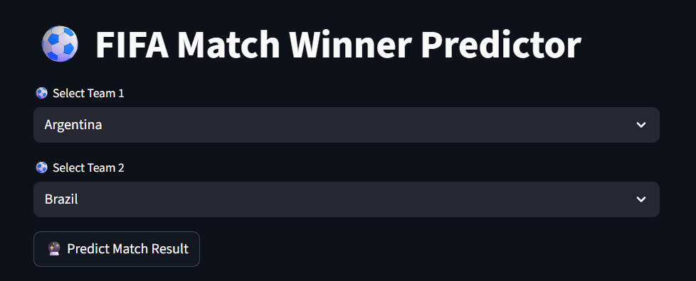
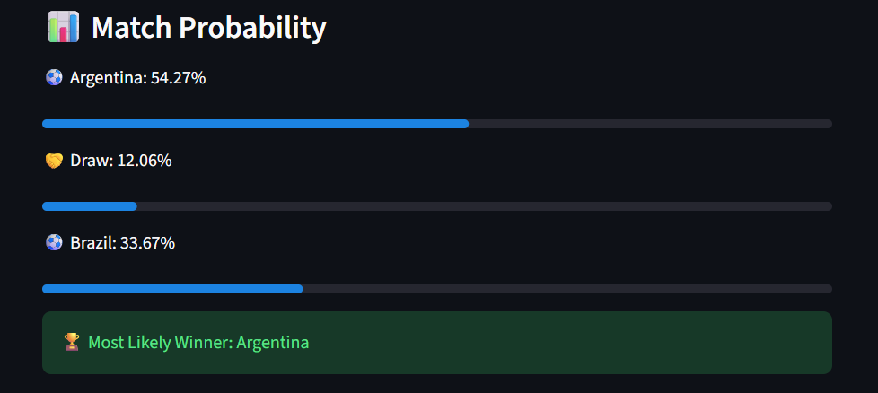

# ⚽ FIFA World Cup Match Winner Predictor

A Machine Learning powered web application that predicts the outcome of a football match between two qualified World Cup teams using historical data and FIFA rankings.

---

## 🚀 Project Overview

This project leverages historical FIFA World Cup match data (1930–2022) and FIFA ranking data to predict the probability of match outcomes. It uses a **Random Forest Classifier** to analyze team strengths and provide insights into potential winners.

### Key Predictions:

- ✅ **Team 1 Win Probability**
- 🤝 **Draw Probability**
- ✅ **Team 2 Win Probability**
- 🏆 **Most Likely Match Outcome**

---

## 📊 Features

- **Interactive UI:** Simple and intuitive team selection using Streamlit.
- **Data-Driven:** Predictions based on ranking differences and historical performance.
- **Visual Feedback:** Colored progress bars indicating winning probabilities.
- **Neutral Comparison:** Handles neutral ground matches without home/away bias.
- **Fast Inference:** Optimized model loading for instant predictions.

---

## 🛠️ Tech Stack

- **Language:** Python
- **ML Framework:** Scikit-learn (Random Forest)
- **Web Framework:** Streamlit
- **Data Manipulation:** Pandas, Numpy
- **Model Serialization:** Joblib

---

## ⚙️ Installation & Setup

### 1. Clone the Repository

```bash
git clone https://github.com/your-username/fifa-winner-prediction.git
cd "FIFA Winner Prediction"
```

### 2. Create a Virtual Environment (Recommended)

```bash
python -m venv venv
# On Windows
venv\Scripts\activate
# On macOS/Linux
source venv/bin/activate
```

### 3. Install Dependencies

```bash
pip install -r requirements.txt
```

---

## 🏃 How to Run

To launch the Streamlit application, run the following command in your terminal:

```bash
streamlit run app.py
```

Once the server starts, open your browser and navigate to `http://localhost:8501`.

---

## 📂 Project Structure

```text
├── assets/                  # Application screenshots
├── FIFA.ipynb              # Jupyter Notebook for model training & EDA
├── app.py                  # Main Streamlit application
├── fifa_match_model.pkl    # Trained Random Forest model
├── team_encoder.pkl        # Label encoder for team names
├── result_encoder.pkl      # Label encoder for match results
├── matches_1930_2022.csv   # Historical match dataset
├── fifa_ranking_... .csv   # FIFA Ranking dataset
├── requirements.txt        # Project dependencies
└── README.md               # Project documentation
```

---

## 🧠 Machine Learning Model

The model is a **RandomForestClassifier** trained on:

- **Historical Results:** All World Cup matches from 1930 to 2022.
- **Features:** Team encodings, Ranking differences, and Total points differences.
- **Target:** Match outcome (Home Win, Draw, Away Win).

---

## 📸 Application Preview

### 📍 Main Interface



### 📊 Prediction Result


