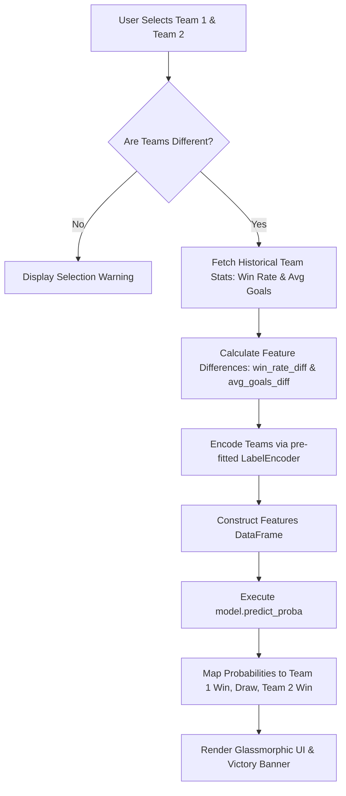
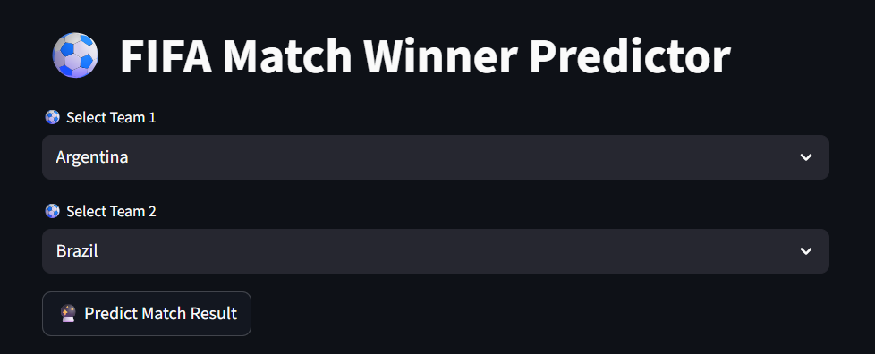
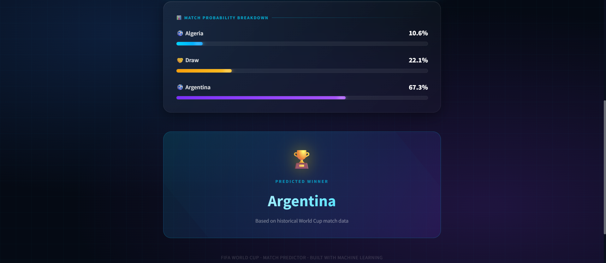

# ⚽ FIFA World Cup Match Winner Predictor

An AI-powered web application that predicts the outcome of a match between any two FIFA World Cup teams using historical match performance statistics spanning from 1930 to 2022. Built with a custom, high-fidelity glassmorphic user interface in Streamlit.

---

## 🚀 Project Overview

Predicting international football matchups requires modeling team historical trends and objective performance indicators. This application leverages a **Random Forest Classifier** trained on official FIFA World Cup match records (1930–2022) to estimate probabilities across three distinct outcomes:

- 🔵 **Team 1 Win**
- 🟠 **Draw**
- 🟣 **Team 2 Win**

Neutral-ground assumptions are applied during inference (`is_home_host=0`, `is_away_host=0`) to eliminate subjective home-field bias and evaluate both teams objectively.

---

## 🎨 Interactive User Interface

The web dashboard is engineered for visual appeal and seamless interaction:

- **Glassmorphic Theme**: Dark radial background, neon accents, blurred cards, and custom scrollbars.
- **Dynamic Team Flags**: Automatic flag fetching via [FlagCDN](https://flagcdn.com/) using ISO team mappings.
- **Visual Probability Distribution**: Color-coded progress bars displaying percentage breakdown for Team 1 Win, Draw, and Team 2 Win.
- **Victory Banner**: Dynamic outcome card highlighting the predicted winner with trophy graphics or indicating an even matchup.

---

## 📊 Features & System Flow

The end-to-end user selection and model inference flow is illustrated below:


```mermaid
graph TD
    A[User Selects Team 1 & Team 2] --> B{Are Teams Different?}
    B -- No --> C[Display Selection Warning]
    B -- Yes --> D[Fetch Historical Team Stats: Win Rate & Avg Goals]
    D --> E[Calculate Feature Differences: win_rate_diff & avg_goals_diff]
    E --> F[Encode Teams via pre-fitted LabelEncoder]
    F --> G[Construct Features DataFrame]
    G --> H[Execute model.predict_proba]
    H --> I[Map Probabilities to Team 1 Win, Draw, Team 2 Win]
    I --> J[Render Glassmorphic UI & Victory Banner]
```

---

## 🧠 Machine Learning Pipeline

### 1. Data Engineering & Feature Selection

The dataset (`all-world-cup-matches.csv`) contains historical match logs from 1930 through 2022. Feature engineering extracts:

- `home_encoded` / `away_encoded`: Categorical integer encodings of team names via a pre-fitted `LabelEncoder`.
- `win_rate_diff`: Difference in historical World Cup win rates between Team 1 and Team 2.
- `avg_goals_diff`: Difference in historical average goals scored per match between Team 1 and Team 2.
- `is_home_host` / `is_away_host`: Host advantage indicators (set to `0` during neutral inference).

### 2. Model Architecture

A **Random Forest Classifier** was selected for its handling of non-linear relationships, multi-class target handling, and resistance to overfitting:

- **Estimators (`n_estimators`)**: 300
- **Max Depth (`max_depth`)**: 12
- **Random State (`random_state`)**: 42

### 3. Performance Metrics

Evaluated on a 20% test partition (155 matches), the model achieves an overall classification accuracy of **~51%** for exact outcome prediction (HomeWin / Draw / AwayWin):

```text
              precision    recall  f1-score   support

     AwayWin       0.45      0.23      0.31        39
        Draw       0.21      0.08      0.12        38
     HomeWin       0.55      0.86      0.67        78

    accuracy                           0.51       155
   macro avg       0.41      0.39      0.36       155
weighted avg       0.44      0.51      0.44       155
```

> [!NOTE]
> Predicting exact draws in international tournaments is inherently volatile due to low draw frequencies in knockouts, resulting in lower recall for Draws while maintaining strong precision and recall for team victory predictions.

---

## 📂 Repository Structure

```text
├── assets/                    # Interface screenshots
│   ├── ss1.png                # Match selection interface
│   └── ss2.png                # Probability breakdown & winner display
├── FIFA.ipynb                 # Jupyter Notebook (EDA, feature engineering, model training)
├── app.py                     # Streamlit web application & glassmorphic UI engine
├── requirements.txt           # Python dependency specifications
├── fifa_model.joblib          # Compressed pipeline bundle (model, encoders & team stats)
├── all-world-cup-matches.csv  # World Cup match dataset (1930–2022)
└── README.md                  # Project documentation
```

---

## 🛠️ Local Development & Setup

### Prerequisites

- **Python 3.8+** installed.

### Steps

1. **Clone the Repository**:

   ```bash
   git clone https://github.com/Aniruddhasain7/FIFA-World-Cup-Match-Winner-Predictor.git
   cd FIFA-World-Cup-Match-Winner-Predictor
   ```

2. **Set Up Virtual Environment**:

   ```bash
   python -m venv venv
   # On Windows:
   venv\Scripts\activate
   # On macOS/Linux:
   source venv/bin/activate
   ```

3. **Install Dependencies**:

   ```bash
   pip install -r requirements.txt
   ```

4. **Run Web Application**:

   ```bash
   streamlit run app.py
   ```

5. Open your browser at `http://localhost:8501`.

---

## 📸 Application Preview

### 📍 Selection Interface



### 📊 Outcome & Probabilities


